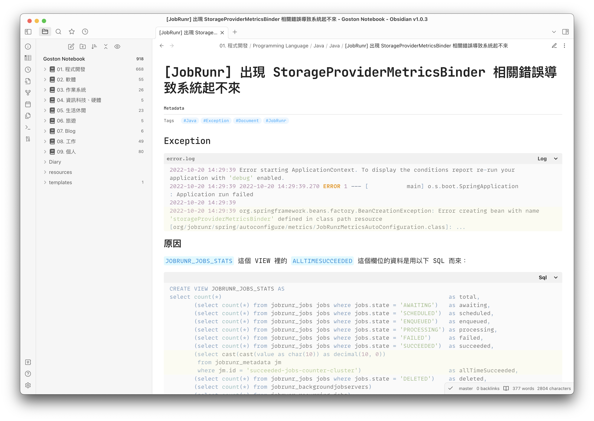
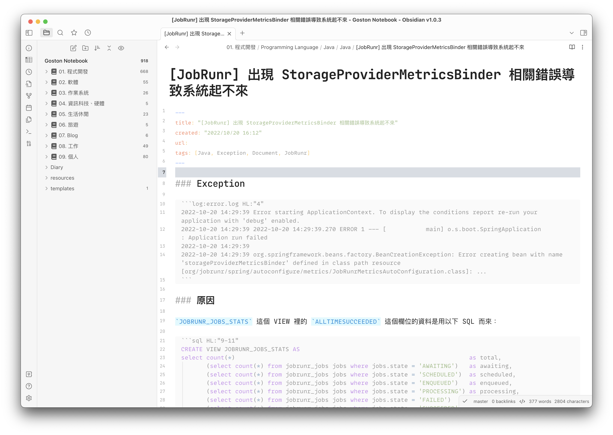
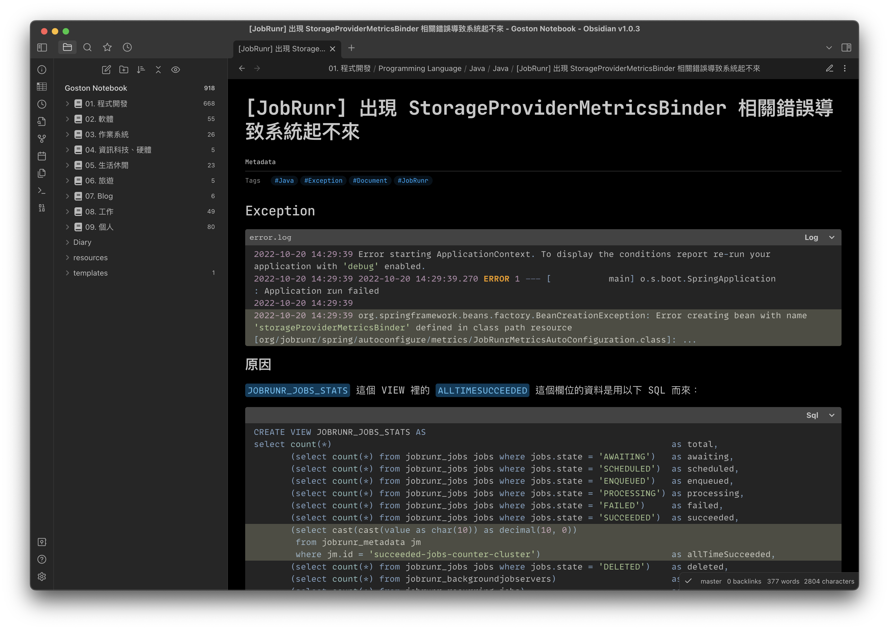
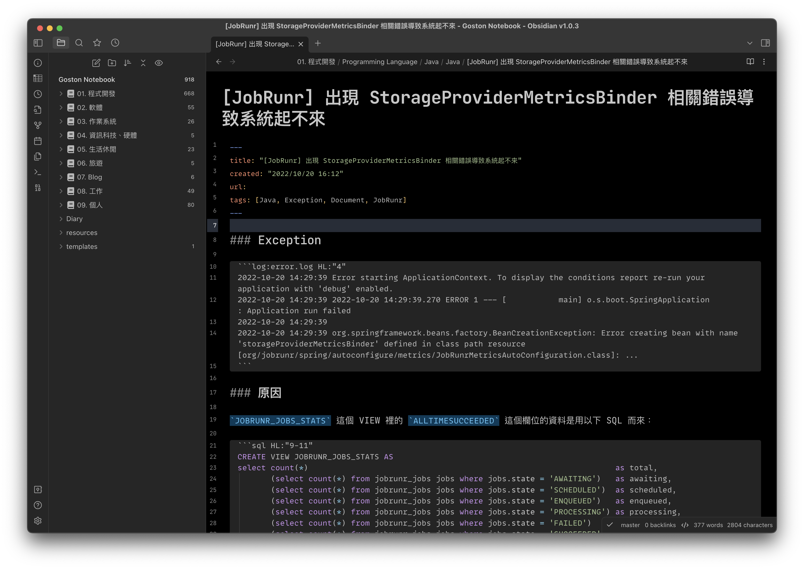

# Obsidian-css

My CSS snippets for Obsidian default theme.

## How to use

1. Download `Goston-snippets.css` or `Goston-snippets.min.css` file 
2. Copy previous file into Obsidian Library `.obsidian/snippets` folder, and enabled it at Preferences → Appearance settings...

> `.min.css` is Minified version of `.css`

## Screenshots

