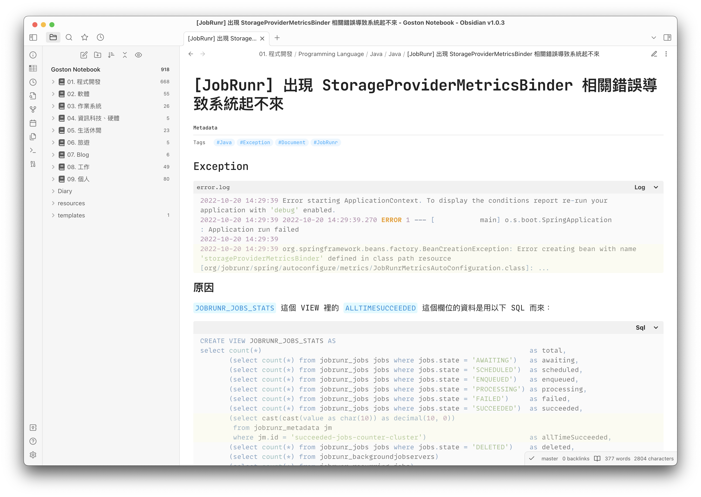
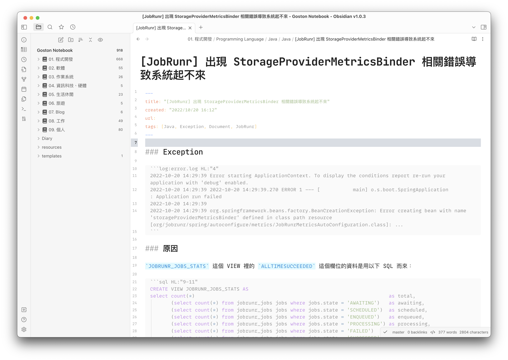
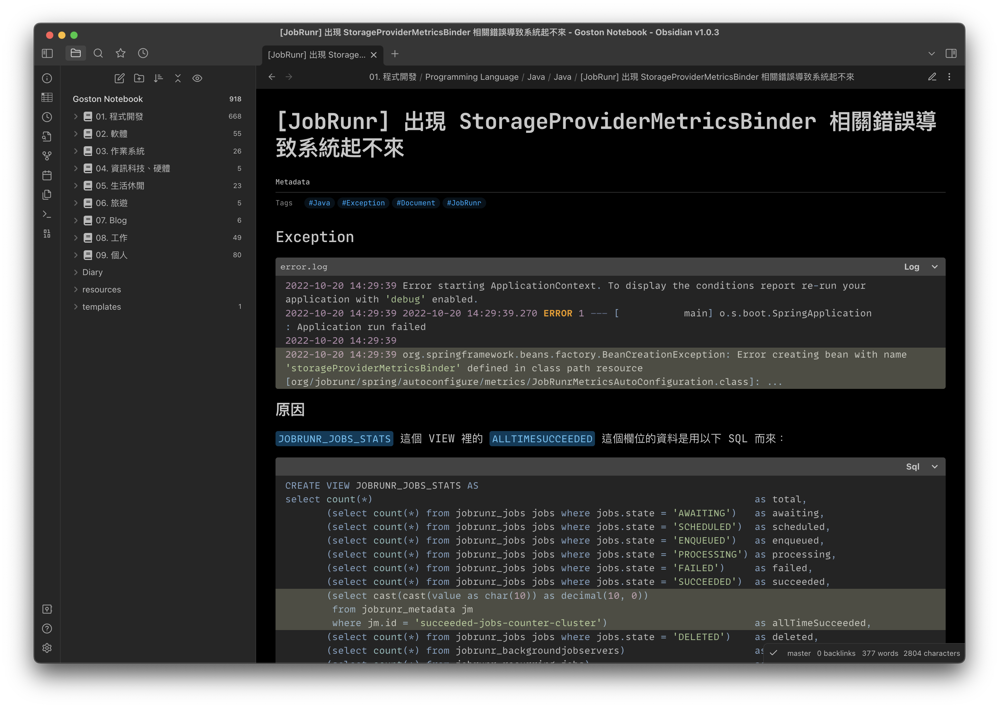
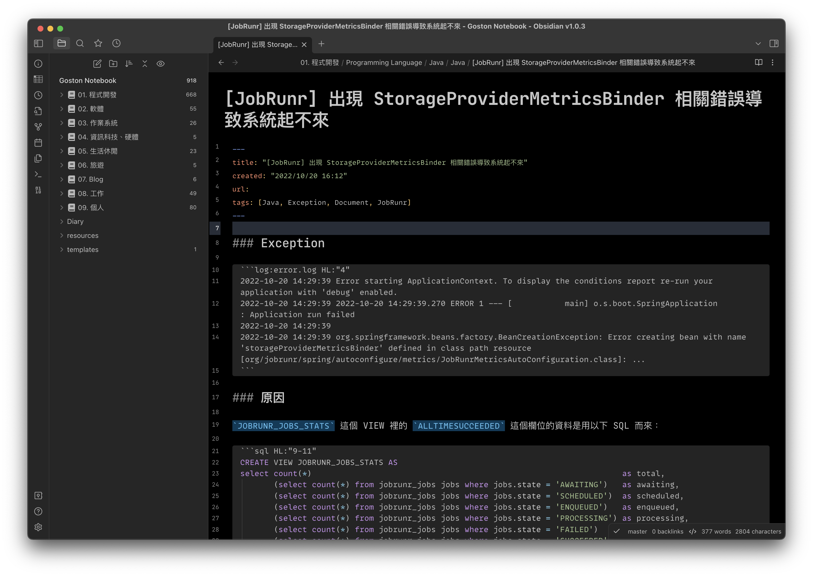

# Obsidian-css

My CSS snippets for Obsidian default theme.

## How to use

1. Download `Goston-variable-snippets.css` **AND** other css snippets files (`*.css`) you need
2. Copy previous download files into Obsidian Snippets folder (default is: `.obsidian/snippets`)
3. Enabled the css snippets at Preferences → Appearance settings...

> - You must download `Goston-variable-snippets.css` first, because other css snippets file depend on it.
> - Every file has a comment at the top of the file, you can read it to know what it does.

## Screenshots

